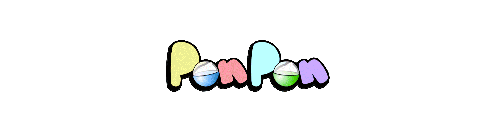

# 3dRandomizer

Welcome to the PonPon 3D randomizer project! 



## Requirements

+ python 3.7 or above; <=3.9.2
+ [Blender](https://www.blender.org/download/) 2.8 or above
+ numpy
+ pandas

## How to install

An easy way to satisfy python dependencies is to install [Anaconda](https://www.anaconda.com/). When it is installed open Anaconda Prompt (Start -> Anaconda Prompt)
```conda create -n py39 python=3.9```

```conda activate py39```

To install the packages:

```pip install numpy pandas```

Clone the repo:

```git clone https://github.com/STASYA00/3dRandomizer```

Set Environment path for Blender:

Follow [this instruction](https://docs.oracle.com/en/database/oracle/machine-learning/oml4r/1.5.1/oread/creating-and-modifying-environment-variables-on-windows.html). In place of the New Path paste the path to your Blender folder (e.g. ```C:\Program Files\Blender Foundation\Blender 2.93```)

## How to use

### Generating images

Double click file ```run.bat``` to run the image generation with the default parameters.

### Parameters

There are a few parameters that can be controlled manually. All of them can be modified in ```config.py``` file. This file can be opened via any text editor (Notepad works too).

*Some of the parameters:*

**IMG_SAVE** - name of the folder to save the images to

**IMAGE_SIZE** - resulting image dimensions (width, height)

**RENDERS** - number of images to generate

**D_PROB** - probability that a face will be in 2D (0.8 means 8 out of 10 will be 2D)

**FACES** - path to the folder with the image textures

**LOG** - name of the log file that stores the configurations' attributes

**ASSEMBLE_FRAME** - in case you are running the assembling of a character's configuration (below), this is the place to indicate the configuration number (e.g. 34)


### Generating an existing configuration

Double click file ```run_assemble.bat``` to run the image generation with the default parameters.
